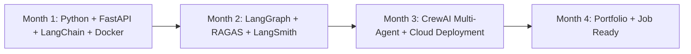

# Noor Ullah — Career Roadmap & TechVault RAG Rebuild Spec

## Candidate Profile & Current Goal
- **Name:** Noor Ullah
- **Role:** Frontend Engineer (4+ years) → Transitioning to **AI Engineer**
- **Target Stack:** Python + FastAPI + LangChain + LangGraph + Qdrant + Gemini / OpenAI
- **Target Goal:** Remote AI Engineer ($3,000 – $5,000 / month)

---

## 📅 6-Month AI Engineer Roadmap



### 🎯 Current Step: Month 1 — TechVault RAG Rebuild
- **Objective:** Rebuild the production NestJS AI Search pipeline using **Python**, **FastAPI**, **LangChain**, and **Gemini Flash**.
- **Key Modules Implemented:**
  1. **Pydantic Intent Extractor:** Converts natural language search queries into structured JSON filters (`category`, `brand`, `max_price_pkr`, `in_stock_only`, `search_query`).
  2. **Qdrant Vector Storage & Ingestion:** Embed catalog using `models/gemini-embedding-001` into Qdrant collection `techvault_products`.
  3. **LCEL RAG Pipeline:** Combine retriever, dynamic prompt, and Gemini LLM into an LCEL chain.
  4. **FastAPI Gateway & Streaming:** Expose `/api/ai-search/chat` with SSE streaming options.

---

## 🛠 Project Structure

```
d:/learning/fastapi_blog/
├── .env                          # Local environment variables (GOOGLE_API_KEY)
├── .env.example                  # Template env file
├── ROADMAP_AND_SPEC.md           # Project roadmap and architecture spec
├── 01_intent_extractor_gemini.py # LangChain + Gemini Intent Extractor script
├── pyproject.toml                # Project configuration & dependencies
└── src/
    └── fastapi_blog/
        ├── __init__.py
        ├── main.py               # FastAPI application entrypoint
        ├── schemas.py            # Pydantic schemas (Search Filters, Chat API)
        ├── models.py             # SQLModel Product/Listing schema
        └── rag_chain.py          # LangChain LCEL RAG chain setup
```
